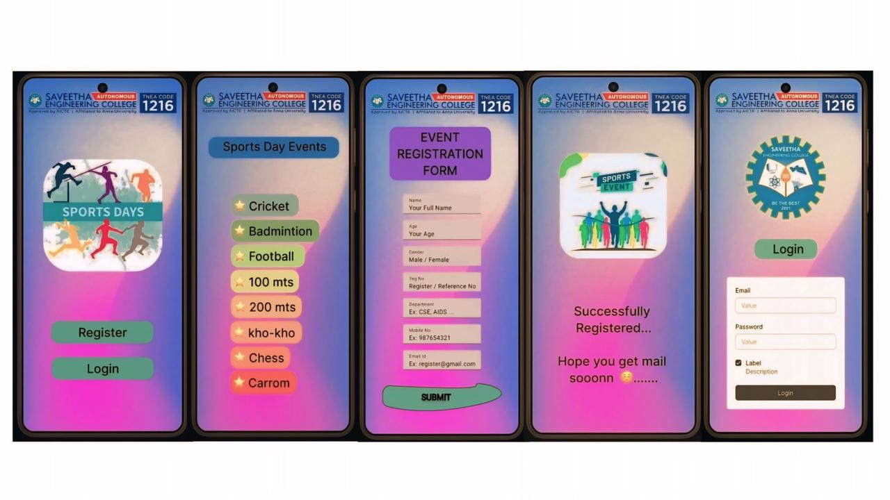

# Ex09 Event Registration Web Application
## Date: 04/10/2025

## AIM:
To design, develop and deploy a web application for event registration.

## DESIGN STEPS:

### Step 1:
Create a new frame.

### Step 2:
Select any one preset size of your choice.

### Step 3:
Select the shapes you need.

### Step 4:
Import images as needed.

### Step 5:
Create pages based on your need and link them.

### Step 6:

Validate the HTML and CSS code.

### Step 6:

Publish the website in the given URL.

## DESIGN TOOL:
Figma

## CODE:
```
Home Page (HTML)
<div class="Android-Compact---1">
    <div class="logo-2"></div>
    <div class="SEC-2"></div>
    <div class="Rectangle-111141358">
    <span class="Register">
        Register
    </span>
    </div>
    <div class="Rectangle-111141359">
    <span class="Login">
        Login
    </span>
    </div>
</div>

CSS

.Android-Compact---1 {
  width: 463px;
  height: 917px;
  flex-grow: 0;
  padding: 0 0 242px;
}
.logo-2 {
  width: 426px;
  height: 64px;
  margin: 27px 19px 152px 18px;
}
.SEC-2 {
  width: 240px;
  height: 231px;
  margin: 152px 112px 49px 111px;
}.Rectangle-111141358 {
  width: 265px;
  height: 58px;
  margin: 49px 99px 36px;
  padding: 8px 66px 8px 67px;
  border-radius: 20px;
  background-color: #84cfc1;
}.Register {
  width: 132px;
  height: 42px;
  font-family: Inter;
  font-size: 32px;
  font-weight: 500;
  font-stretch: normal;
  font-style: normal;
  line-height: 1.35;
  letter-spacing: normal;
  text-align: center;
  color: #000;
}.Rectangle-111141359 {
  width: 265px;
  height: 58px;
  margin: 36px 98px 0 100px;
  padding: 8px 66px 8px 67px;
  border-radius: 20px;
  background-color: #84cfc1;
}.Login {
  width: 132px;
  height: 42px;
  font-family: Inter;
  font-size: 32px;
  font-weight: 500;
  font-stretch: normal;
  font-style: normal;
  line-height: 1.35;
  letter-spacing: normal;
  text-align: center;
  color: #000;
}
```

## OUTPUT:


## RESULT:
The program to design, develop and deploy a web application for event registration is completed successfully.
